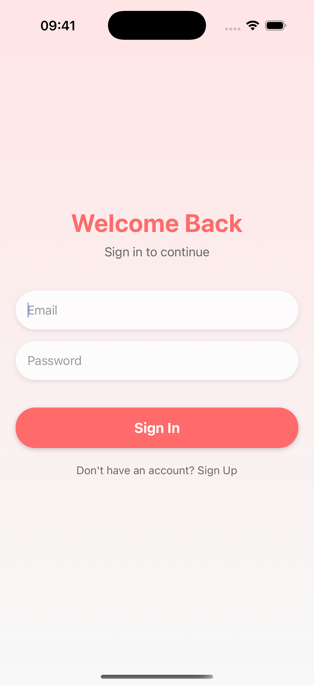
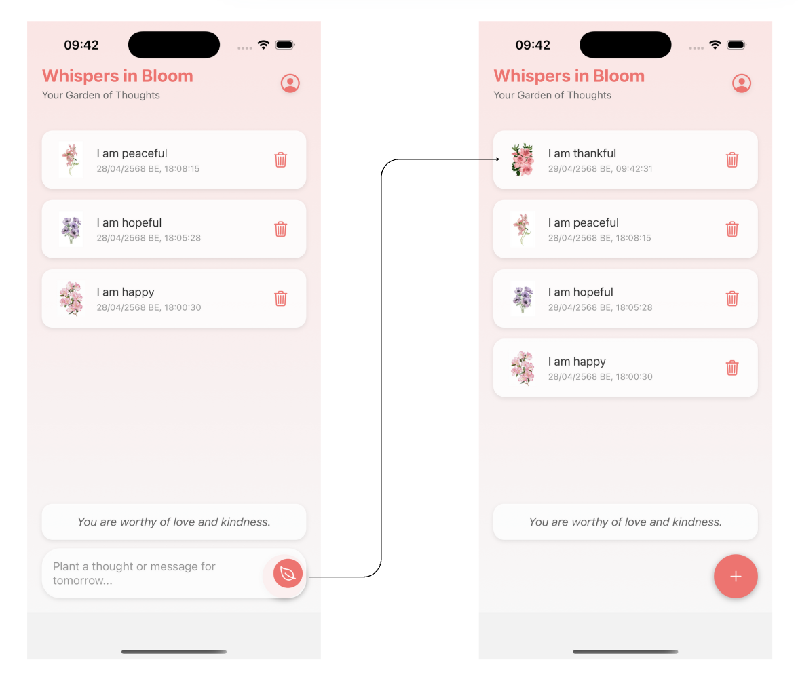
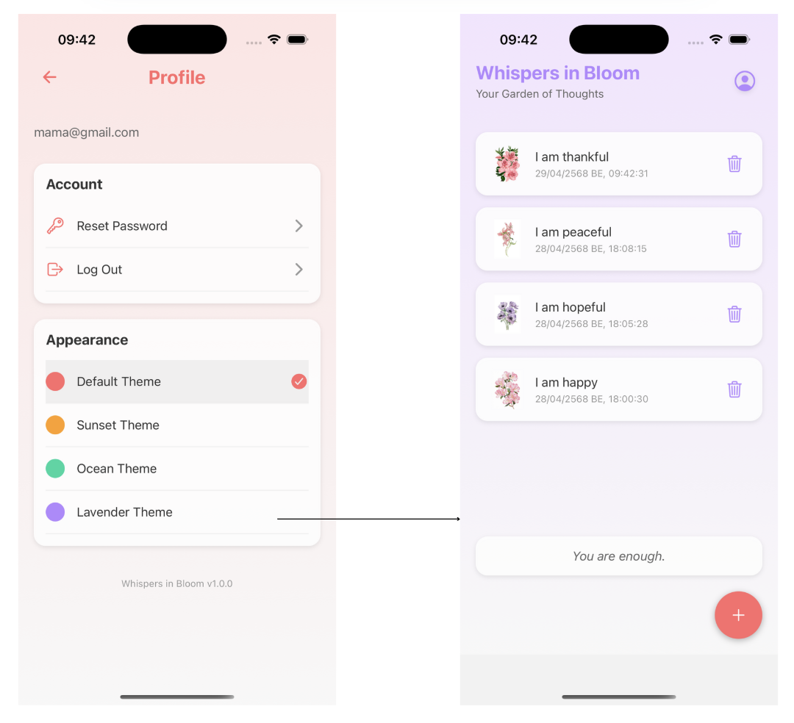

# 📱 แบบฟอร์มส่งงานสอบ Take-home | Take-home Assignment Template
**ชื่อ - นามสกุล (Full Name):**  Tanitsorn Sathon
**รหัสนักศึกษา (Student ID):**  6631503022 
**ชื่อแอป (App Name):**  Whispers in Bloom
**Framework ที่ใช้ (Framework Used):** React Native
**ลิงก์ GitHub Repository:** [https://github.com/6631503022-Tanitsorn/Whispers-in-Bloom.git]  
**ลิงก์ไฟล์ติดตั้ง (APK/IPA):** [https://drive.google.com/file/d/1rLZ_QaRQsZDfLhUPIxDYKnFyhQjspAuk/view?usp=sharing]

---

## 1. การออกแบบแอป | App Concept and Design (2 คะแนน / 2 pts)

### 1.1 ผู้ใช้งานเป้าหมาย | User Personas  
**ตัวอย่าง (Example):**
```markdown
Persona 1:  
- ชื่อ: แทน
- อายุ: 25 ปี  
- อาชีพ: พนักงานออฟฟิศ
- ความต้องการ: ต้องการพาพื้นที่ส่วนตัวในการผ่อนคลายและสะท้อนความคิดหลังจากวันที่เหนื่อยล้า

Persona 2:  
- ชื่อ: เลโอ
- อายุ: 30 ปี  
- อาชีพ: ฟรีแลนซ์  
- ความต้องการ: ต้องการแอปที่ช่วยให้รู้สึกสงบและสามารถจดบันทึกความรู้สึกในแต่ละวัน
```

### 1.2 เป้าหมายของแอป | App Goals  
**ตัวอย่าง (Example):**
```markdown
- สร้างพื้นที่ส่วนตัวสำหรับการสะท้อนความคิดและความรู้สึก
- ส่งเสริมการดูแลตนเองผ่านการจดบันทึกเชิงบวก
- มอบประสบการณ์ที่เรียบง่ายและสงบโดยไม่มีสิ่งรบกวน
```

### 1.3 โครงร่างหน้าจอ / Mockup  
**ใส่รูปภาพ หรือคำอธิบายแต่ละหน้าหลัก 3 หน้า | Attach image or describe 3 main pages**
```markdown
1. Welcome Page:
   - Users can sign up for a new account or sign in to an existing one.
   - The page includes form fields for email and password, and buttons for both actions.
2. Garden Page:
   - Users can "plant" their thoughts—these are text entries reflecting their feelings or reflections.
   - Each thought is paired with a flower that visually represents the emotion or content of the thought.
   - The planted thoughts and flowers are displayed in the user’s garden view.
   - Users can delete their planted thoughts if desired.
   - A random positive quote is shown on this page to cheer the user up.
3. Profile Page:
   - Users can reset their password securely.
   - Option to log out from their account.
   - Users can also change the theme color of the app (e.g., default, sunset, ocean, and lavender theme).
```

### 1.4 การไหลของผู้ใช้งาน | User Flow  
**ตัวอย่าง (Example):**
```markdown
1. แตะไอคอน "ใบไม้" → ป้อนข้อความเชิงบวก
2. ข้อความที่ป้อนจะแสดงเป็นดอกไม้
3. ในช่วงกลางคืน → ผู้ใช้สามารถเขียนข้อความถึงตัวเองในวันพรุ่งนี้
```

---

## 2. การพัฒนาแอป | App Implementation (4 คะแนน / 4 pts)

### 2.1 รายละเอียดการพัฒนา | Development Details  
**เครื่องมือที่ใช้ / Tools used:**
```markdown
- React Native (JavaScript)
- Xcode
- Expo
```

### 2.2 ฟังก์ชันที่พัฒนา | Features Implemented  
**Checklist:**
```markdown
- [x] ฟังก์ชันการปลูกความคิดในแต่ละวัน
- [x] ฟังก์ชันการเขียนข้อความถึงตัวเองในวันพรุ่งนี้
- [x] หน้าสวนส่วนตัวที่แสดงดอกไม้จากข้อความที่ปลูก
- [x] ข้อความให้กำลังใจขณะพิมพ์ปลูกความคิด
```

### 2.3 ภาพหน้าจอแอป | App Screenshots  
**แนบภาพหรือ URL (Attach images or image links):**
```markdown
- 
- 
- 
```

---

## 3. การ Build และติดตั้งแอป | Deployment (2 คะแนน / 2 pts)

### 3.1 ประเภท Build | Build Type
- [x] Debug  
- [ ] Release  

### 3.2 แพลตฟอร์มที่ทดสอบ | Platform Tested  
- [x] Android  
- [ ] iOS  

### 3.3 ไฟล์ README และวิธีติดตั้ง | README & Install Guide  
**แนบไฟล์หรือคำอธิบายการติดตั้งแอป | Insert steps**
```markdown
1. ติดตั้ง Node.js
    - ดาวน์โหลด Node.js ได้ที่ [https://nodejs.org/](https://nodejs.org/)
      ```
2. Clone โปรเจกต์นี้ลงเครื่อง
    ```bash
    git clone [url โปรเจกต์ GitHub หรือ repo]
    ```
3. เข้าไปในโฟลเดอร์โปรเจกต์
    ```bash
    cd WhispersInBloom
    ```
4. ติดตั้ง dependencies ที่ต้องใช้
    ```bash
    npm install
    ```
5. ติดตั้ง Expo CLI (ถ้ายังไม่ได้ติดตั้ง)
    ```bash
    npm install -g expo-cli
    ```
6. เริ่มต้นเซิร์ฟเวอร์เพื่อรันแอป
    ```bash
    expo start
    ```
    - จากนั้นสแกน QR Code ด้วยแอป **Expo Go** เพื่อเปิดแอปบนมือถือ
```

---

## 4. การสะท้อนผลลัพธ์ | Reflection (2 คะแนน / 2 pts)

**ตัวอย่างหัวข้อ | Suggested points:**
```markdown
- พบปัญหาในการจัดการสถานะระหว่างการปลูกความคิดและการแสดงผลในสวน
- เรียนรู้การใช้ Context API ร่วมกับ AsyncStorage เพื่อจัดการข้อมูลและสถานะอย่างมีประสิทธิภาพ
- หากมีเวลาเพิ่มเติม จะพัฒนาฟีเจอร์การซิงค์ข้อมูลกับ Cloud และรองรับการใช้งานบน ios
```
---

## 5. การใช้ AI ช่วยพัฒนา | AI Assisted Development (Bonus / ใช้ประกอบการพิจารณา)

### 5.1 ใช้ AI ช่วยคิดไอเดีย | Idea Generation
```markdown
Prompt ที่ใช้:  
"แอปที่ให้ความรู้สึกอบอุ่น ผ่อนคลาย และเป็นพื้นที่ส่วนตัวสำหรับผู้ใช้"

ผลลัพธ์:  
ได้แนวคิดแอป 'Whispers in Bloom' ที่เน้นการปลูกความคิดเชิงบวกในสวนส่วนตัว
```

### 5.2 ใช้ AI ช่วยออกแบบ UI | UI Layout Prompt
```markdown
Prompt ที่ใช้:  
"ออกแบบหน้าจอแอปที่มีพื้นหลังสีพาสเทล ปุ่มเดียว และแอนิเมชันที่เคลื่อนไหวช้าๆ"

ผลลัพธ์:  
ได้แนวทางการออกแบบหน้าต้อนรับและหน้าสวนส่วนตัวที่เรียบง่ายและสงบ
```

### 5.3 ใช้ AI ช่วยเขียนโค้ด | Code Writing Prompt
```markdown
Prompt ที่ใช้:  
"React Native code สำหรับการใช้ Context API ร่วมกับ AsyncStorage เพื่อจัดการข้อมูลผู้ใช้"

ผลลัพธ์:  
ได้ตัวอย่างโค้ดที่ช่วยในการจัดการสถานะและการจัดเก็บข้อมูลภายในเครื่อง

```

### 5.4 ใช้ AI ช่วย debug | Debug Prompt
```markdown
Prompt ที่ใช้:  
"แอป React Native แสดงข้อผิดพลาดเมื่อพยายามบันทึกข้อมูลด้วย AsyncStorage"

ผลลัพธ์:  
AI แนะนำให้ตรวจสอบการเรียกใช้ AsyncStorage.setItem() และการจัดการ async อย่างถูกต้อง
```

### 5.5 ใช้ AI ช่วย Deploy | Deployment Prompt
```markdown
Prompt ที่ใช้:  
"วิธีการ build แอป React Native, Expo เป็นไฟล์ IPA, .apk บนอุปกรณ์ andriod"

ผลลัพธ์:  
คำสั่ง 'expo build:andriod' พร้อมขั้นตอนการติดตั้งไฟล์ .apk บนอุปกรณ์
```

---

## ✅ Checklist ก่อนส่ง | Final Checklist
- [x] กรอกข้อมูลครบทุก Section  
- [x] แนบ GitHub และไฟล์ติดตั้ง  
- [x] สะท้อนผล และใช้ AI อย่างมีเหตุผล  
